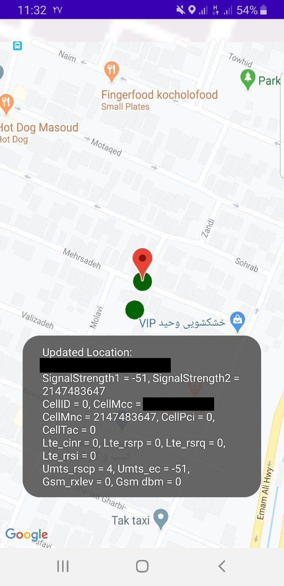

# Rhodium

The goal of this project is to get the blind spot in the coverage of mobile networks.

The UE ( User Equipment ) starts moving in a certain direction. The UE continuously measures related parameters when it receives power.

Parameters might be for the server cell or neighboring cells. Power information might also be for the server cell and neighboring cells.
The parameters are RxLev, C1, C2 for GSM, RSCP, EC/N0 for UMTS, and RSRP, RSRQ, CINR for LTE.

UE returns the measured values every four seconds.
The values are TAC( Tracking Area Code ), RAC( Routing Area Code ), LAC( Location Area Code), PLMN( Public Land Mobile Network), Cell Identity. 

The measured values are stored in a database (Room Database).

The user can view the stored data online or offline on a map.
A color dot will be inserted on the map whenever UE is moved to a different location,
According to your measurement of the cell's power output, these colors are selected. It can be green, yellow, orange, red, or black. The color black implies a failed measurement.

## Language
The project is written in Java(Android).

## Images
</img> 

## Contributing
Pull requests are welcome. For major changes, please open an issue first to discuss what you would like to change.

Please make sure to update tests as appropriate.

## License
[MIT](https://choosealicense.com/licenses/mit/)
